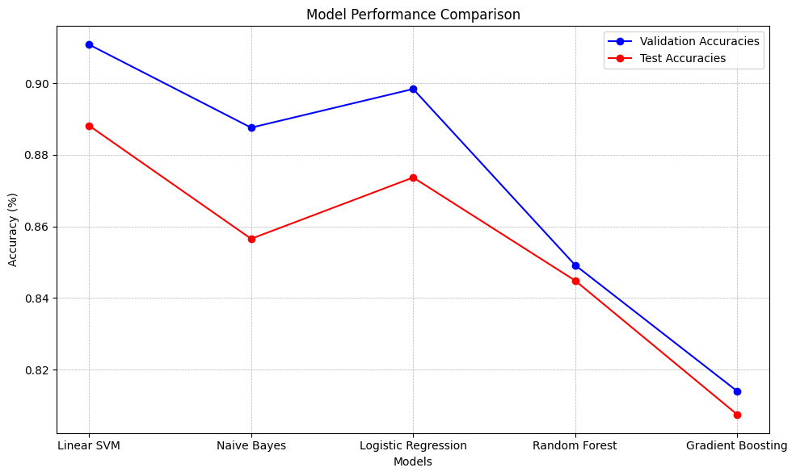

# Sentiment Analysis on Stanford's Movie Review Corpus

## Overview
This project focuses on performing sentiment analysis on Stanford's movie review dataset. Various machine learning models, including Linear SVM, Naive Bayes, Logistic Regression, Random Forest, and Gradient Boosting, are trained and evaluated to classify movie reviews as positive or negative.

## Getting Started

### 1. Dataset
The dataset can be downloaded from Stanford's website at the following link:
[Stanford Movie Review Dataset](https://ai.stanford.edu/amaas/data/sentiment/)

After downloading, unzip the files and place them in a directory named `data` within the project's root directory.

### 2. Installation
To set up the required environment:

```bash
pip install -r requirements.txt
```


## Results
Based on the conducted experiments, the following accuracies were observed on the test set:

| Model               | Test Accuracy (%) |
|---------------------|-------------------|
| Linear SVM          | 88.82             |
| Logistic Regression | 87.37             |
| Naive Bayes         | 85.66             |
| Random Forest       | 84.49             |
| Gradient Boosting   | 80.75             |

From the results, the Linear SVM and Logistic Regression models stood out with their high accuracies, showcasing their effectiveness for this sentiment analysis task.



For a more detailed comparison and analysis, refer to the output plots generated by the script or the provided report.


## Authors
Parsa Mazaheri, October 2023